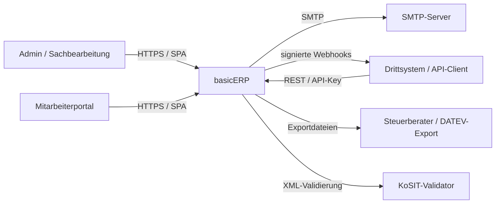
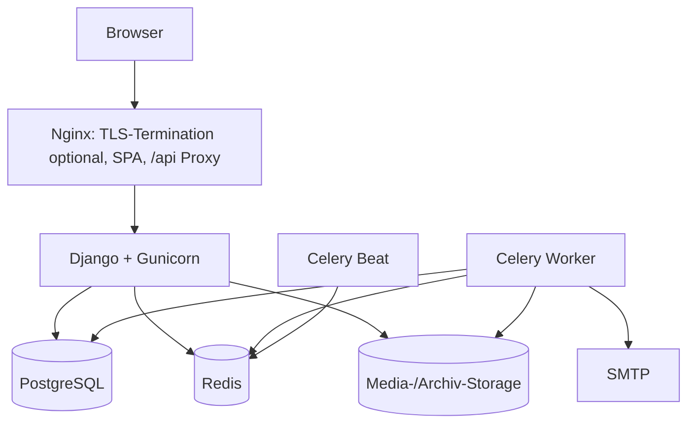
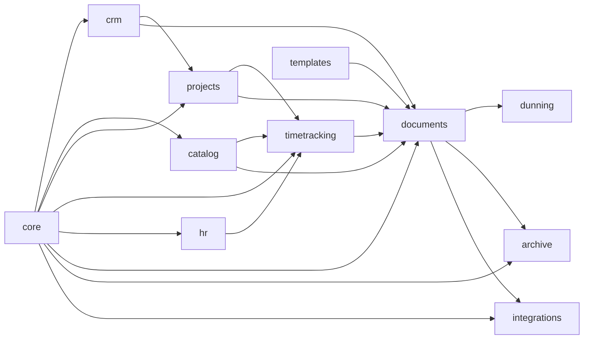
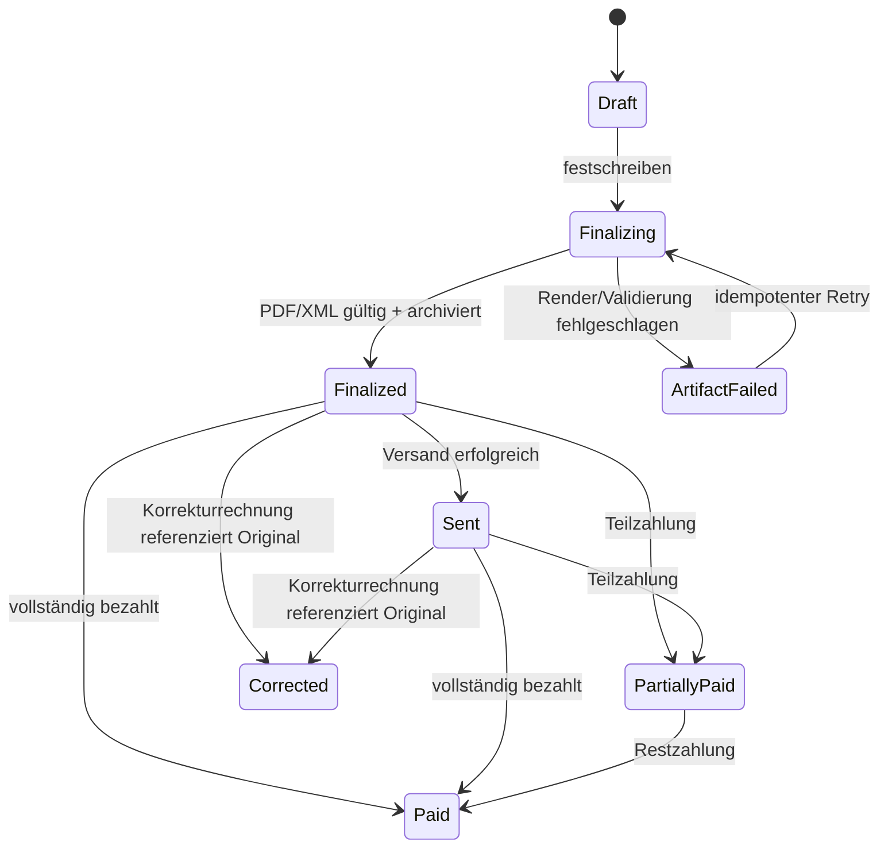

# basicERP – Softwarearchitektur

**Stand:** 05.10.2026
**Status:** Angenommen; Phase 0 in Umsetzung
**Zugehörige Entscheidung:** [`ADR-0001`](adr/0001-modularer-monolith.md), [`ADR-0002`](adr/0002-belegfestschreibung-und-outbox.md)

## 1. Kurzfassung

basicERP wird als **modularer Monolith** in einem Monorepo gebaut:

- Django/DRF enthält Domäne, Anwendungsservices und die versionierte REST-API.
- React/TypeScript ist ein unabhängiger API-Client und enthält keine
  geschäftskritischen Berechnungen.
- PostgreSQL ist die einzige fachliche Source of Truth.
- Celery führt langlebige und wiederholbare Jobs aus; Redis ist Broker/Cache,
  niemals dauerhafte Fachablage.
- Ein transaktionales Outbox-Muster koppelt Datenbankänderungen sicher an PDF,
  E-Mail, Webhooks und weitere Hintergrundarbeit.
- Belege werden bei Festschreibung als unveränderlicher fachlicher Snapshot
  gespeichert. PDF und E-Rechnungsformate entstehen ausschließlich daraus.
- Dateien liegen hinter einer Storage-Schnittstelle; lokales Docker-Volume ist
  der 1.0-Default. Ein externer WORM-/S3-kompatibler Speicher bleibt möglich.
- Der unterstützte Docker-Pfad verwendet Linux-Container: unter Windows via
  Docker Desktop, unter Ubuntu via Docker Engine mit Compose-Plugin.

Damit bleiben Deployment und lokale Entwicklung einfach, während die fachlichen
Grenzen später eine gezielte Extraktion einzelner Dienste zulassen.

## 2. Architekturtreiber

### Funktionale Treiber

- Durchgängiger Projekt-/Zeit-/Rechnungsprozess.
- Rechts- und prüfungsrelevante Zustandsübergänge müssen nachvollziehbar sein.
- API-first für SPA, Imports, API-Keys und Webhooks.
- PDF, XRechnung und ZUGFeRD müssen aus identischen Rechnungsdaten entstehen.
- Mitarbeiter- und Personalaktendaten benötigen strengere Isolation.
- Self-Hosting muss für kleine Betriebe beherrschbar bleiben.

### Qualitätsziele in Prioritätsreihenfolge

1. **Korrektheit und Nachvollziehbarkeit:** Geld-, Steuer-, Nummern- und
   Belegzustände sind deterministisch, auditierbar und testbar.
2. **Sicherheit und Datenschutz:** Least Privilege, sichere Defaults, getrennte
   Berechtigungen für HR und Integrationen.
3. **Wartbarkeit:** klare Modulverantwortung, migrationsfähige Schemata und
   dokumentierte Entscheidungen.
4. **Betriebsfähigkeit:** reproduzierbarer Container-Start, Backups, Restore,
   Healthchecks und verständliche Fehlerbilder.
5. **Performance:** interaktive Listen reagieren im Normalfall schnell;
   schwere Arbeit blockiert keine Web-Anfrage.

### Initiale Kapazitätsgrenze

Die Architektur wird zunächst für bis zu etwa 100 benannte Benutzer, 25
gleichzeitig aktive Benutzer, 1 Mio. Zeiteinträge, 100.000 Belege und 100 GB
Archivinhalt ausgelegt. Das ist eine Planungsannahme, die durch Lasttests mit
realistischen Such-, Listen- und Abrechnungsfällen verifiziert wird.

## 3. Systemkontext



Nicht im Systemkontext von 1.0: Banknetz, Peppol, Lohnabrechnung, Lager,
Multi-Tenant-SaaS und doppelte Buchführung.

## 4. Container- und Laufzeitarchitektur



### Verantwortlichkeiten

| Baustein | Verantwortung | Darf nicht |
|---|---|---|
| Nginx | statische SPA, Upload-Limits, Proxy, optionale TLS-Terminierung | Fachzustände kennen |
| Django Web | Auth, Autorisierung, API, synchrone Validierung/Transaktionen | lange PDF-/Importjobs in Requests ausführen |
| Celery Worker | PDF/XML, E-Mail, Import, Webhook, periodische Läufe | nicht idempotent auf Fachzustände schreiben |
| Celery Beat | nur periodische Job-Anstöße | Fachlogik enthalten |
| PostgreSQL | Fachzustand, Outbox, Audit, Suchindizes | Binärdateien als Standardablage aufnehmen |
| Redis | Queue, kurzlebiger Cache, Rate-Limit-Zähler | alleinige Quelle für fachlich relevante Daten sein |
| Storage | Originale und erzeugte Artefakte | bestehende Archivobjekte überschreiben |

Für Produktion werden Web, Worker und Beat getrennt gestartet, obwohl sie
dasselbe Backend-Image verwenden. Das erlaubt unabhängige Ressourcenlimits und
verhindert, dass PDF-Last API-Anfragen verdrängt.

## 5. Repository-Struktur

```text
basicERP/
├── backend/
│   ├── config/                 # Settings, URL-Konfiguration, ASGI/WSGI, Celery
│   ├── apps/
│   │   ├── core/
│   │   ├── crm/
│   │   ├── catalog/
│   │   ├── projects/
│   │   ├── timetracking/
│   │   ├── hr/
│   │   ├── documents/
│   │   ├── templates/
│   │   ├── dunning/
│   │   ├── archive/
│   │   └── integrations/
│   └── tests/
├── frontend/
│   ├── src/app/                # Router, Providers, Shell
│   ├── src/features/           # Fachliche UI-Slices
│   ├── src/components/         # Fachlich neutrale UI-Bausteine
│   └── src/api/                # generierter Client + dünne Adapter
├── docker/
├── docs/
│   └── adr/
└── compose.yaml
```

Tests liegen bevorzugt beim Modul. Ein kleiner systemweiter E2E-Satz prüft die
kritischen Wertströme.

## 6. Fachliche Module und Abhängigkeiten



Pfeile zeigen „wird von fachlich benötigt“, nicht Python-Importfreiheit. Um
Zyklen zu verhindern, gelten folgende Regeln:

1. Jedes Modell hat genau ein Eigentümermodul.
2. Fremde Module ändern dessen Zustand nur über öffentliche Anwendungsservices.
3. API-Views rufen Anwendungsservices auf; komplexe Logik lebt weder im View
   noch im Serializer oder React-Client.
4. Asynchrone Reaktionen nutzen Domain-Ereignis + Outbox.
5. `core` bleibt klein: Identität, Firma, Rollen, Nummernkreis-Grundlagen,
   Audit-/Outbox-Infrastruktur und gemeinsame primitive Typen. Es wird kein
   Sammelplatz für beliebige Hilfslogik.

### Besondere Grenzentscheidung für HR

`hr` wird schon in v0.4 mit einem minimalen Employee-/Abwesenheitsschema
angelegt und in v0.9 erweitert. Dadurch müssen Urlaubskonten und Fremdschlüssel
nicht später aus `timetracking` verschoben werden. Personalakten bleiben in
einem eigenen, besonders geschützten Teil des Moduls und Storage-Namensraums.

## 7. Schichten innerhalb eines Backend-Moduls

```text
api/              DRF Serializer, ViewSets, URL-Routen
application/      Use Cases, Transaktionsgrenzen, Berechtigungsorchestrierung
domain/           Berechnungen, Policies, Zustandsautomaten, Value Objects
models/           persistente Django-Modelle und Constraints
tasks/            idempotente Celery-Einstiegspunkte
events/           publizierte Eventverträge
```

Das ist eine Leitstruktur, kein Zwang zu leeren Verzeichnissen. Einfache
CRUD-Funktionen dürfen einfach bleiben; komplexe Rechnungs-, Steuer- und
Freigabelogik folgt der Trennung konsequent.

## 8. Daten- und Domänenmodell

### Gemeinsame Regeln

- Primärschlüssel: UUID für öffentlich referenzierte Fachobjekte.
- Geld: `Decimal`, niemals Binär-Float; API überträgt Geldwerte als Strings.
- Zeit: Speicherung in UTC, Darstellung in Firmenzeitzone; reines
  Leistungsdatum als `date` ohne Zeitzonenumrechnung.
- Löschung: Stammdaten erhalten gegebenenfalls `archived_at`; referenzierte oder
  aufbewahrungspflichtige Objekte werden nicht hart gelöscht.
- Gleichzeitige Bearbeitung: `version`/optimistisches Locking für Entwürfe;
  Konflikt liefert HTTP 409 statt stilles Überschreiben.
- Fremdschlüssel schützen historische Daten mit `PROTECT` oder Snapshots.

### Zentrale Aggregate

| Aggregat | Wichtige Invarianten |
|---|---|
| CompanySettings | genau ein aktiver Firmenkontext pro Installation |
| Contact | stabile Kundennummer; Firma/Person; mehrere typisierte Adressen |
| CatalogItem | Preis/Steueränderungen überschreiben keine historischen Belege |
| Project | Kunde, Status und Budget; Sätze werden zeitlich/sachlich eindeutig aufgelöst |
| TimeEntry | positive Dauer, Mitarbeiter/Projekt, Abrechnungsstatus; abgerechnete Einträge gesperrt |
| Invoice | Summe der Positionen/Steuern; erlaubter Zustandsübergang; finaler Snapshot unveränderlich |
| NumberSequence | Eindeutigkeit je Dokumentart/Jahr; Zuweisung unter Datenbanksperre |
| Payment | Summe darf fachlich nachvollziehbar zu offen/teil-/bezahlt führen |
| ArchiveObject | unveränderlicher Dateischlüssel, Hash, Größe, MIME, Ursprung, Aufbewahrung |
| OutboxEvent | unveränderliches Payload, Status, Versuche, nächster Versuch, eindeutiger Eventschlüssel |

### Rechnungssnapshot

Eine festgeschriebene Rechnung referenziert nicht nur lebende Stammdaten. Sie
enthält einen versionierten Snapshot von Aussteller, Empfänger, Adressen,
Positionstexten, Preisen, Steuern, Zahlungsdaten und rechtlichen Hinweisen. Nur
so bleiben PDF und XML auch nach Stammdatenänderungen reproduzierbar.

## 9. Rechnungs- und Artefaktprozess



`Finalizing` ist bereits fachlich festgeschrieben: Der Snapshot ist ab dann
nicht mehr editierbar. Ein technischer Fehler verbraucht keine zweite Nummer;
der Retry arbeitet mit derselben Snapshot-/Nummernidentität.

### Festschreibung

1. Anwendungsservice prüft Entwurf, Berechtigungen, Pflichtfelder und Version.
2. In einer DB-Transaktion wird der Nummernkreis per `SELECT ... FOR UPDATE`
   gesperrt, die nächste Nummer vergeben und der unveränderliche Snapshot
   geschrieben.
3. Audit- und Outbox-Ereignisse werden in derselben Transaktion gespeichert.
4. Worker berechnet/erzeugt PDF und strukturierte Formate deterministisch aus
   dem Snapshot, validiert sie und legt sie unter neuen Storage-Schlüsseln ab.
5. Erst nach Hash-/Metadatenpersistenz wird `Finalized` erreicht. Versandjobs
   dürfen nur von dort starten.

### Berechnungen

- Eine zentrale Rechnungs-Engine ist die einzige Quelle für Netto, Rabatt,
  Steuerbasis, Steuerbetrag und Brutto.
- Rundungsmodus und Rundungsebene werden explizit definiert und über ein
  fachlich freigegebenes Testkorpus abgesichert.
- §19-, 0-%-, 7-%-, 19-%-, Rabatt-, Teilzahlungs-, Korrektur- und gemischte
  Steuerfälle erhalten Golden-Master-Fälle.

## 10. E-Rechnung und PDF

```text
InvoiceSnapshot vN
  ├─ Standard-/Vorlagen-HTML + CSS ──> WeasyPrint ──> PDF
  ├─ EN-16931 Mapping ───────────────> CII XML ─────> Validator
  └─ EN-16931 Mapping ───────────────> UBL XML ─────> Validator
                                          │
                    PDF/A-3 + CII XML <───┘  (ZUGFeRD)
```

- XML und PDF werden nicht voneinander abgeleitet, sondern aus demselben
  kanonischen Snapshot.
- Mappings sind versioniert; Artefakte speichern Mapper-/Schema-Version.
- Der offizielle Validator läuft im CI über ein Grenzfallkorpus und beim
  Festschreiben. Ein Validierungsfehler verhindert den Versand dieses Formats.
- Empfangene Originaldateien werden vor jeder Extraktion unverändert archiviert.
  Extrahierte Daten sind abgeleitete Metadaten, nicht Ersatz des Originals.
- Die Leitweg-ID ist B2G-spezifisch und deshalb optional am Kontakt, nicht
  allgemeine Voraussetzung jeder E-Rechnung.

### Vorlagen

Vorlagen sind versionierte JSON-Dokumente mit bekannten Zonen und
whitelist-basierten Blocktypen. Kein Benutzer-HTML, JavaScript oder beliebiges
CSS wird ausgeführt. Dokumente referenzieren die konkrete Vorlagenversion.
Browser-Vorschau und WeasyPrint nutzen dieselbe serverseitig erzeugte HTML/CSS-
Quelle; visuelle Regressionstests erkennen Rendering-Abweichungen.

## 11. API-Architektur

- Basis: `/api/v1/`; OpenAPI ist Teil des Builds.
- Ressourcenorientiertes REST für CRUD, benannte Aktionen für Zustandswechsel,
  z. B. `POST /api/v1/invoices/{id}/finalize`.
- Listen verwenden einheitliche Filter-, Sortier- und Paginationparameter.
- Datums-/Zeitwerte sind ISO 8601, Geld/Decimal bleiben JSON-Strings.
- Fehler folgen einem einheitlichen Problem-JSON mit stabilem Fehlercode,
  menschenlesbarem Text und feldbezogenen Details.
- Kritische POSTs und Imports unterstützen einen Idempotency-Key.
- Zustandswechsel prüfen die erwartete Objektversion, um Doppelaktionen und
  verlorene Updates zu verhindern.
- Swagger dient Entwicklern; fachliche Integrationsbeispiele werden zusätzlich
  gepflegt. Generierter TypeScript-Client verhindert Frontend-/API-Drift.

## 12. Authentisierung und Autorisierung

### Interne SPA

- Serverseitige Session in sicherem `HttpOnly`-/`Secure`-/`SameSite`-Cookie.
- CSRF-Schutz für jede schreibende Anfrage; keine Tokens in `localStorage`.
- Passwort-Reset mit kurzlebigem Einmal-Token; Brute-Force-Schutz am Login.

### Externe API

- API-Keys werden nur einmal angezeigt und ausschließlich gehasht gespeichert.
- Jeder Key hat Scopes, optional IP-/Ablaufbegrenzung und einen Besitzer.
- Rate Limits und vollständiges Nutzungsprotokoll; sofortige Sperrmöglichkeit.

### Berechtigungen

- Default Deny auf API- und Service-Ebene.
- Rollen sind eine grobe Bündelung; objektbezogene Policies prüfen Eigentum,
  Mitarbeiterbezug, Dokumentzustand und HR-Vertraulichkeit.
- Personalakten erhalten getrennte Endpunkte, Storage-Präfixe und negative
  Isolationstests. Normale Admin-Rechte implizieren nicht automatisch HR-Zugriff.

## 13. Zuverlässige Nebenwirkungen

Das Speichern eines Fachobjekts und das Publizieren einer Nachricht dürfen
nicht auseinanderfallen. Deshalb schreibt dieselbe DB-Transaktion ein
`OutboxEvent`. Ein Dispatcher beansprucht Einträge mit Row Locks, führt den
idempotenten Handler aus und protokolliert Ergebnis und Retry.

Anwendungsfälle:

- PDF-/XML-Erzeugung
- E-Mail-Versand
- Webhook-Zustellung mit HMAC, Exponential Backoff und Dead-Letter-Sicht
- CSV-Importnachbereitung
- Mahnlaufvorschläge

Periodische Jobs erzeugen nur Vorschläge. Rechts-/kundenwirksamer
Mahnungsversand benötigt in 1.0 eine manuelle Freigabe.

## 14. Archivierung und GoBD-Nähe

Ein SHA-256-Hash weist Integrität nach, macht eine Ablage aber allein nicht
revisionssicher. basicERP kombiniert daher:

- append-only Archivmetadaten und nie wiederverwendete Storage-Schlüssel,
- gesperrte Update-/Delete-Wege in Anwendung und Datenbankrollen,
- Audit-Ereignisse mit Benutzer, Zeitpunkt, Ursache und Objektversion,
- regelmäßige Integritätsprüfungen,
- gemeinsame, konsistente Sicherung von Datenbank und Dateien,
- dokumentierte und getestete Wiederherstellung,
- exportierbare Originale, Metadaten und maschinenlesbare Prüfdaten,
- optionale Anbindung eines Objektspeichers mit Retention/Object Lock.

Die Aufbewahrungsfrist ist eine Policy pro Dokumentklasse, nicht eine einzige
globale Zahl: Rechnungen/Buchungsbelege sind regelmäßig acht Jahre, bestimmte
Unterlagen zehn und andere sechs Jahre aufzubewahren; Sonderfälle können die
Frist verlängern. Der Fristbeginn wird regelbasiert ab Kalenderjahresende
berechnet und bleibt fachlich konfigurierbar. Löschung erfolgt nie automatisch
ohne protokollierte Freigabe.

Die mitgelieferte Verfahrensdokumentation beschreibt Sollprozess, technische
Versionen, Betrieb, Sicherung, Änderungen und Verantwortlichkeiten. Die
ordnungsgemäße Organisation beim Betreiber bleibt dessen Pflicht.

## 15. Frontend-Architektur

- Feature-Slices spiegeln Backend-Domänen, nicht einzelne Seiten.
- Serverzustand wird über eine Query-/Mutation-Schicht verwaltet; keine zweite
  fachliche Datenbank im Client.
- Formulare verwenden dieselben API-Fehlercodes und validieren bequem im Client,
  aber verbindlich nochmals auf dem Server.
- Ein gemeinsames Listenmuster bündelt URL-basierte Filter, Suche, Sortierung,
  Pagination, Empty/Error/Loading States und Berechtigungen.
- Verwaltung ist responsive; Mitarbeiterportal wird mobile-first und
  tastatur-/screenreader-tauglich umgesetzt.
- Kritische Geld-/Steuerberechnungen werden nur angezeigt, nicht im Client als
  maßgebliche Wahrheit berechnet.

## 16. Betrieb und Sicherheit

### Konfiguration

- 12-Factor-Konfiguration über Umgebungsvariablen/Secret-Dateien.
- Keine Standardpasswörter; Start bricht bei unsicheren Produktionswerten ab.
- Getrennte Settings für Dev/Test/Prod mit sicherem Prod-Default.

### Beobachtbarkeit

- Strukturierte JSON-Logs mit Request-/Correlation-ID.
- Audit-Log ist fachlich und getrennt vom technischen Log.
- Health: Prozess-Liveness und Readiness für DB/Redis/Storage.
- Metriken: Requestdauer/Fehler, Queuealter, Jobfehler, Outboxrückstand,
  Speicherverbrauch, Backup-/Integritätsstatus.
- Personenbezogene Inhalte, Belegtexte, Passwörter und Schlüssel werden nicht
  in technische Logs geschrieben.

### Backup und Upgrade

- PostgreSQL und Storage werden als konsistentes Set gesichert.
- Verschlüsselte Backups, definierte Aufbewahrung und regelmäßig getesteter
  Restore; ein vorhandenes Backup gilt erst nach Restore-Test als brauchbar.
- Migrationen laufen als expliziter einmaliger Release-Schritt, nicht parallel
  in jedem Web-Container.
- Vorwärtskompatible Expand/Migrate/Contract-Änderungen, wenn Datenvolumen oder
  Verfügbarkeit es erfordern.

### Security-Baseline

- Abhängigkeiten und Containerimages scannen; Patch-Updates regelmäßig bündeln.
- Uploads per Größe, MIME, Dateisignatur und Parser-Sandboxing begrenzen.
- Content Security Policy, sichere Header, CSRF/CORS-Allowlist.
- SSRF vermeiden: Webhookziele validieren und interne/private Netze standardmäßig sperren.
- HMAC-signierte Webhooks, rotierbare Secrets, Replay-Schutz.
- OWASP-orientierte Tests vor 1.0; Bedrohungsmodell für Dokumente, HR und Integrationen.

## 17. Testarchitektur

| Ebene | Schwerpunkt |
|---|---|
| Domain-Unit-Tests | Steuer/Rundung, Nummernfolge, Zustandsautomaten, Fristen, Zinsen |
| Model-/Constraint-Tests | Eindeutigkeit, Sperren, unveränderliche Snapshots, Fremdschlüsselschutz |
| API-Tests | Auth, Scopes, Objektberechtigung, Idempotenz, Fehlerformat, OpenAPI |
| Contract-Tests | Frontend-Client, Webhook-Payloads, versionierte Eventverträge |
| Worker-Tests | Retry, Deduplizierung, Teilfehler, Outbox-Recovery |
| Golden-Master | PDF-Inhalte, EN-16931-Mapping, Validatorfälle, DATEV-Dateien |
| UI-Komponenten | Formulare, Listen, Status- und Fehlerzustände |
| Playwright-E2E | Login, Zeit → Rechnung, Festschreibung, Versand, Zahlung, Mahnung |
| Restore-/Upgrade-Test | Backup wiederherstellen; letzte unterstützte Version migrieren |

Die CI trennt schnelle Pull-Request-Prüfungen von schwereren PDF-/KoSIT-/E2E-
Suites. Ein Release erfordert beide.

## 18. Bewusste Trade-offs

| Entscheidung | Vorteil | Preis |
|---|---|---|
| Modularer Monolith | einfache Transaktionen und Betrieb | Disziplin für Modulgrenzen nötig |
| PostgreSQL als einzige Source of Truth | Konsistenz und einfache Sicherung | keine unabhängige Skalierung pro Modul |
| Session für SPA | sicherer als Browser-Tokenablage, einfach widerrufbar | CSRF und gleicher Site-Kontext zu beachten |
| Outbox statt direktem Task-Publish | keine verlorenen Nebenwirkungen | Dispatcher, Status und Cleanup nötig |
| Snapshot bei Festschreibung | reproduzierbare Belege | Datenverdopplung und Schemaversionierung |
| Zonen-/Block-Editor | beherrschbar und sicher | weniger Gestaltungsfreiheit als freies Canvas |
| Docker Compose als 1.0-Pfad | geringe Einstiegshürde | keine eingebaute Hochverfügbarkeit |

## 19. Spätere Neubewertung

Die Architektur wird überprüft, wenn mindestens eines zutrifft:

- echter Multi-Tenant-/SaaS-Betrieb wird Produktziel,
- einzelne Worker-Lasten benötigen eine andere Laufzeit oder unabhängige
  Skalierung,
- mehr als etwa 25 gleichzeitige Benutzer oder große Imports zeigen messbare
  Engpässe,
- ein Modul braucht eigenständige Release-/Compliance-Zyklen,
- lokaler Dateispeicher erfüllt die Betreiberanforderungen nicht,
- Hochverfügbarkeit mit definiertem RTO/RPO wird vertraglich gefordert.

Erst dann werden betroffene Bausteine extrahiert. Microservices sind kein
vorweggenommenes Ziel.

## 20. Quellen und Geltungsgrenze

- Django 5.2 ist eine LTS-Version: https://docs.djangoproject.com/en/5.2/releases/5.2/
- BMF FAQ E-Rechnung: https://www.bundesfinanzministerium.de/Content/DE/FAQ/e-rechnung.html
- § 147 AO: https://www.gesetze-im-internet.de/ao_1977/__147.html
- § 14b UStG: https://www.gesetze-im-internet.de/ustg_1980/__14b.html
- GoBD im amtlichen AO-Handbuch 2026: https://amtliche-handbuecher.bundesfinanzministerium.de/ao/2026/Anhaenge/BMF-Schreiben-und-gleichlautende-Laendererlasse/Anhang-33/inhalt.html

Diese Architektur setzt technische Kontrollen um, stellt aber keine Rechts- oder
Steuerberatung und keine Zertifizierung der Ordnungsmäßigkeit dar.
